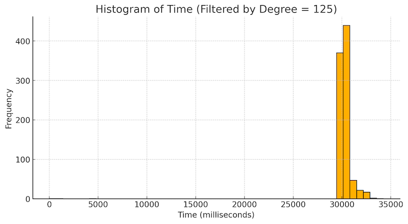
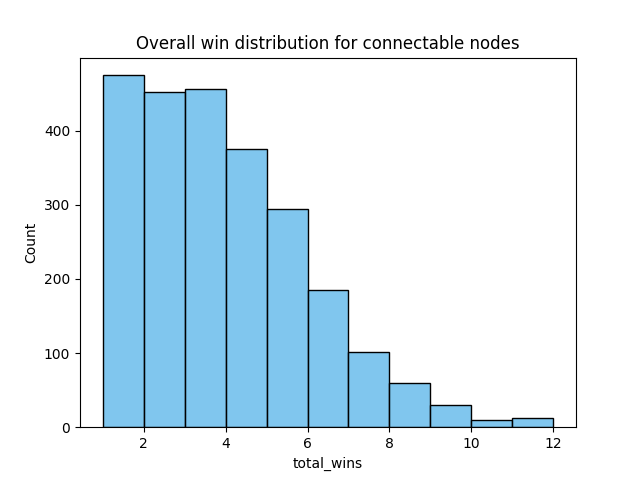
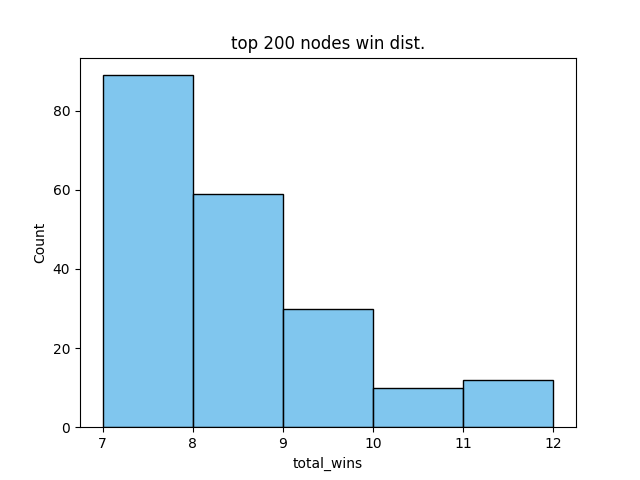
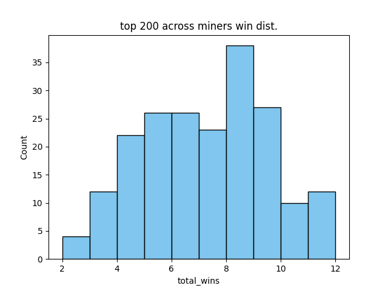

## Mempool Partitioning and Identifying Mining Nodes

### Motivation
I wanted to see how difficult it would be to practically identify mining nodes (or mining-adjacent)
nodes on the Bitcoin p2p network in 2025. With the influential set of mining nodes, it becomes
easier to launch attacks like pinning, replacement cycling, or other yet-to-be-discovered mempool/LN
attacks. It has previously been shown in the CoinScope paper [1] that influential nodes on the Bitcoin
network can be identified by coloring nodes with conflicting transactions. These influential nodes may
not be the miner's gateway node but could instead be connected to it. Also, the mempool has been very
empty and I wanted to take advantage.

### Methodology

- First, I needed a list of listening p2p nodes. To obtain this, I queried the Core DNS seeds and then
crawled the network via ADDRs.
- The list then needed cleaning. Nodes that did not accept incoming connections were removed from the
list. This resulted in a list of about 5,700 nodes. This is an underscraping of the network given
that the scraping of addrmans was not done over a significant period of time and the GETADDR cache in
Core only rolls over about once a day.
- I connected to each of these nodes and recorded the duration of the connection in seconds. I noticed
a spike at around 30 seconds, meaning that ~800 nodes were disconnecting us after 30 seconds. This
graph shows the spike at 30 seconds for nodes that accept >= 125 inbound connections (in addition to
the peers that they already have):

- Further inspection revealed that the nodes spam INVs, use `/Satoshi:27.0.0/` as the user agent, use
`SFNodeNetwork|SFNodeBloom|SFNodeNetworkLimited|0x800` as service flags, and don't participate
in TX relay. This last bit I discovered by sending transactions only to these nodes. For these
reasons, I removed these nodes from the list. At this point the list was finalized.
- To find the influential nodes from this list, I used the Candidate Selection (CS) algorithm from
Section 5.3 of the CoinScope paper. The CS algorithm is characterized by a number `M` and denotes how
many sets we'll split the list into. Each set will receive a conflicting transaction. If a set has
its conflict transaction mined, every address in the set will have a win-score incremented. The paper
also uses a routine called InvBlock to prevent disjoint sets from learning about other conflict
transactions. Because of changes to Core, I don't believe that InvBlock is applicable anymore. Rather
than 500 trials with an `M=100`, I chose to do 100 trials with `M=20`.
- Every test iteration, I also looked to see which conflict transaction mempool.space had. Since I
tagged the conflict transactions by sequence number `nSequence = <set_idx> + (1 << 31)`, I didn't have
to compare transaction hashes and could instead note down the `set_idx` from the interval `[0, M)`.

### Results
In the 100 tests, Foundry mined 34 of the conflicts, AntPool mined 15, ViaBTC mined 12, MARA
mined 8, F2Pool mined 7, SECPOOL mined 6, BraiinsPool mined 5, and the rest were a collection of
different, smaller miners. These 7 top miners account for roughly 87% of the network's hashrate.
mempool.space had a conflicting transaction from what was mined 91/100 times. In other words, the
mempool.space node(s) was unintentionally partitioned 91% of the time.

Plotting the distribution of win scores from the 100 trials gives the following distribution:

The majority of these peers, however, did not complete the version-verack handshake. Filtering
these out gives the following exponential distribution:

From here, the win list needed to be validated to see whether the top nodes were indeed influential
nodes. To do this, I followed the Influence Validation (IV) algorithm in the paper. In this
algorithm, the influential set is treated as a singleton set and is given one conflict transaction
while the rest of the network is given a different conflict transaction. I defined the influential
set as the top 200 nodes from my sorted win list. The win distribution for the top 200 nodes looks
like this and is the tail of the original win distribution:

In 20 trials, the top 200 influential set won 8 times, meaning this set represented about 40% of the
network's hashrate.

In addition to the overall win list, I had also created win lists for the 7 miners listed earlier.
These lists contained the influential nodes behind individual mining pools. I noticed that many nodes
on this list were not in the top-200 but were influential in their own right. I believe that some of
the Foundry, AntPool, and ViaBTC nodes were over-represented in the influential set when there are other
pools to consider. For comparison against the original top-200 list, I created a new top-200 list by
taking the top 25 addresses from each of the 7 miner win lists. The remaining 25 were filled in from the
original win list starting from the top, taking care to ensure no duplicates. The win distribution in
this list was noticeably different:

In 20 trials, this set performed better with 10 of the blocks containing the influential set's
conflict transaction. This means that the newer set represents about 50% of the network's hashrate.
Since the set of 7 miners together represent about 87% of the hashrate, it seems that they use
multiple gateway nodes and some of these redundant nodes were not in the influential set. Further
analysis could likely find these nodes.

### Conclusion
Even though the top-200 list I constructed only represents 50% of the network's hashrate, an
attacker wanting to launch mainnet partitioning / pinning attacks may find that this is enough of
a win-rate to profit. Additionally, an attacker wanting to get a higher win-rate can spam the
_entire_ network rather than just 200 influential nodes. The fact that mempool.space was
unintentionally partitioned 91% of the time goes to show that partitioning can work with high
probability.

### Future Directions
- We can analyze the influential set further by sending transactions to these nodes and
checking merkle branches from stratum jobs to see which mining pools start to include the
transaction (assuming we are able to generate a similar merkle branch ourselves).
- Narrow down the list of 200 using additional logs or come up with a highly influential set that
is as small as possible.
- Include more than just IPv4 and IPV6 addresses in case non-clearnet nodes are influential.
- Clean up and share the light client code.

[1] CoinScope - https://www.cs.umd.edu/projects/coinscope/coinscope.pdf